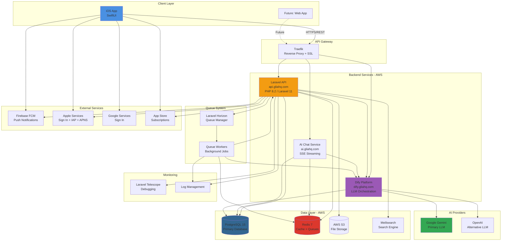
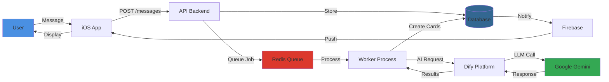
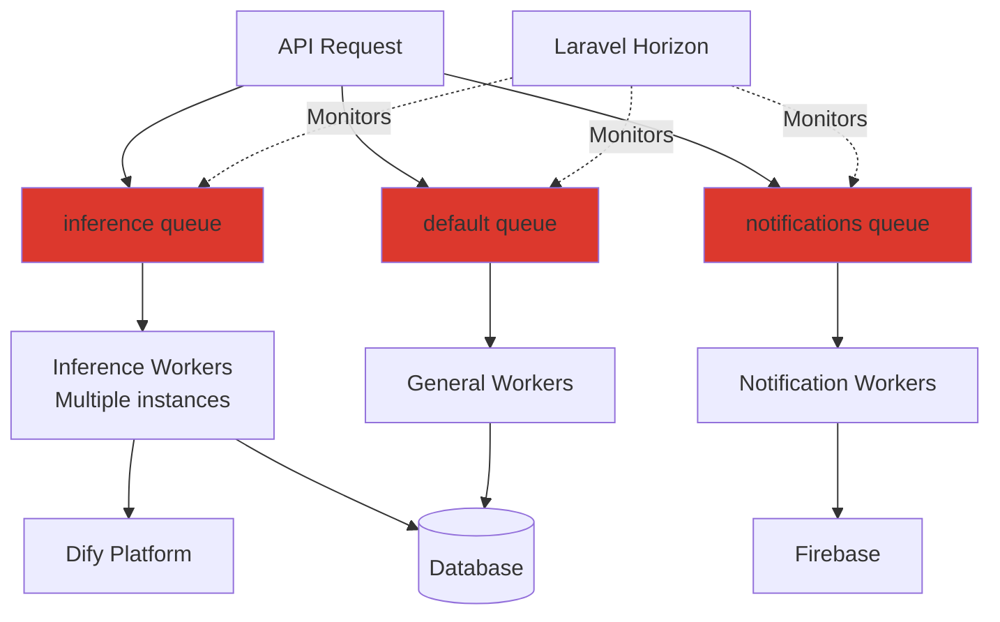

# Glia HQ - High-Level Architecture Overview
## For CTO Onboarding

---

## System Architecture - Platform View



---

## Data Flow Overview



---

## Technology Stack Summary

| Layer | Technology | Purpose |
|-------|-----------|---------|
| **Frontend** | Swift + SwiftUI | iOS native app |
| **Backend API** | Laravel 11 (PHP 8.2) | REST API, business logic |
| **AI Orchestration** | Dify | LLM workflow management |
| **LLM** | Google Gemini (primary) | AI inference |
| **Database** | PostgreSQL 15 | Primary data store |
| **Cache/Queue** | Redis 7 | Caching + async jobs |
| **File Storage** | AWS S3 | Images, attachments |
| **Search** | Meilisearch | Full-text search |
| **Server** | Laravel Octane (FrankenPHP) | High-performance PHP |
| **Proxy** | Traefik | Reverse proxy + SSL |
| **Queue Manager** | Laravel Horizon | Queue monitoring |
| **Push Notifications** | Firebase FCM | Mobile notifications |
| **Payments** | App Store IAP | Subscriptions |
| **Infrastructure** | AWS + Docker | Cloud hosting |

---

## Key System Flows

### 1. User Message → AI Cards

```
User sends message
    ↓
iOS app → API (REST)
    ↓
API stores message in PostgreSQL
    ↓
API queues 2 background jobs:
    • ChatSynthesisJob (memory + people cards)
    • ActivityDetectionJob (activity tracking)
    ↓
Workers pick up jobs from Redis
    ↓
Workers call Dify with user context
    ↓
Dify calls Google Gemini
    ↓
Results create journey cards
    ↓
Cards scheduled for delivery
    ↓
Notification sent via Firebase FCM
    ↓
User sees new cards in app
```

### 2. Card Delivery System

```
Card created by AI
    ↓
Card type determines delivery:
    • memory_synthesis → Immediate
    • people → Scheduled 12 PM
    • activity → After enhancement
    • knowledge/affirmation → Next window (9AM/12PM/5PM/9PM)
    ↓
DeliverScheduledCards command runs every 6 hours
    ↓
Eligible cards marked as delivered
    ↓
Push notification sent
```

### 3. Authentication Flow

```
User signs in (Apple/Google/Email)
    ↓
iOS app → API /auth/[provider]Login
    ↓
API validates with Apple/Google
    ↓
API creates/updates user in PostgreSQL
    ↓
API returns bearer token
    ↓
iOS stores token + uses for all requests
```

---

## Core Domains

### 1. **Conversations & Messages**
- User chats with AI
- Messages stored in PostgreSQL
- SSE streaming for real-time responses

### 2. **Journey System**
- Dynamic journeys created by AI
- Organized by category (Love, Work, Skills/Hobbies)
- Week-based progression
- Contains cards of various types

### 3. **Journey Cards (6 Types)**
- **Activity**: Tracks ongoing activities/projects
- **Memory Synthesis**: Synthesized memories from conversations
- **People**: Relationship tracking
- **Knowledge**: Educational content
- **Affirmation**: Positive reinforcement
- **Reflection**: Weekly reflections

### 4. **AI Inference Pipeline**
- 15+ different inference types
- Each type has: DataProvider → Handler → Result processor
- Async processing via Laravel queues
- Results create/update cards in journeys

### 5. **Subscriptions**
- App Store in-app purchases
- Plans stored in PostgreSQL
- Transaction verification
- Feature gating

---

## Infrastructure Details

### AWS Services Used
- **EC2**: Application servers
- **RDS**: PostgreSQL database
- **S3**: File storage for images
- **ElastiCache**: Redis cluster (inferred)
- **Route 53**: DNS (inferred)

### Environments
- **Production**: `api.gliahq.com`
- **Staging**: `api.qa.gliahq.com`
- **Local**: Docker Compose setup

### Deployment
- Docker containers
- Docker Compose orchestration
- Traefik for routing and SSL
- Multiple compose files per environment

---

## Queue Architecture



**3 Queue Types:**
1. **inference**: AI processing jobs (high priority)
2. **default**: General background tasks
3. **notifications**: Push notification delivery

---

## API Structure

### Main Domains
```
/api/auth/*              Authentication
/api/users/*             User management
/api/messages/*          Chat messages
/api/conversations/*     Chat conversations
/api/journeys/*          Journey management
/api/journey-cards/*     Card management
/api/memories/*          Memory CRUD
/api/inferences/*        AI inference triggers
/api/payment/*           Subscriptions
/mcp/*                   Model Context Protocol (future LLM integration)
```

### Authentication
- **Bearer token** (Laravel Sanctum)
- **JWT** for MCP endpoints
- Social auth (Apple, Google)

---

## Development Setup (High-Level)

```bash
# Prerequisites
- PHP 8.2+
- Composer
- Docker Desktop
- Node.js

# Setup
1. Clone repository
2. Copy .env.example → .env
3. Generate SSL certificates (mkcert)
4. docker compose up -d
5. composer install
6. php artisan migrate
7. composer dev (runs: server + queues + vite)

# Access
- API: https://gliahq.test
- Horizon: https://gliahq.test/horizon
- Telescope: https://gliahq.test/telescope
```

---

## Key Technical Decisions

### Why Laravel?
- Mature PHP framework
- Built-in queue system (Horizon)
- Eloquent ORM for PostgreSQL
- Octane for high performance
- Rich ecosystem

### Why Dify?
- LLM orchestration and workflow management
- Provider-agnostic (can switch between OpenAI, Gemini, etc.)
- Built-in prompt management
- Workflow versioning

### Why Google Gemini?
- Cost-effective
- Good performance for use case
- Easy integration via Dify

### Why PostgreSQL?
- Robust relational database
- JSON support for flexible data
- Strong Laravel support
- Good performance at scale

### Why Redis?
- Fast caching
- Queue backend
- Session storage
- Pub/sub capabilities

---

## Scaling Considerations

### Current State
- Single-server deployment (inferred)
- Docker Compose orchestration
- PostgreSQL single instance
- Redis single instance

### Future Scaling Path
1. **Horizontal API scaling**: Multiple Laravel app servers behind load balancer
2. **Database**: RDS Multi-AZ, read replicas
3. **Redis**: ElastiCache cluster
4. **Workers**: Autoscaling worker pools
5. **CDN**: CloudFront for S3 assets
6. **Monitoring**: CloudWatch, Datadog, or New Relic

---

## Security Highlights

✓ SSL/TLS via Traefik
✓ Token-based auth
✓ Social login providers
✓ Input validation
✓ SQL injection prevention (ORM)
✓ CORS configured
✓ Environment variable secrets
✓ Payment verification

---

## Monitoring & Observability

**Built-in Tools:**
- Laravel Telescope (requests, queries, exceptions)
- Laravel Horizon (queue monitoring)
- Laravel Pail (log streaming)

**Logging:**
- Application logs
- Queue job logs
- Error tracking
- Performance metrics

---

## Critical Workflows to Understand

1. **Message → AI Cards**: Core product value
2. **Card Delivery Scheduling**: User experience timing
3. **AI Inference Pipeline**: How all AI features work
4. **Journey Auto-creation**: Dynamic journey system
5. **Payment Verification**: Revenue flow


*Last updated: November 2025*
